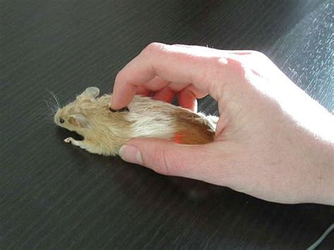

# Aras Power Search 🔥

## Usage

This is intended for keyboard driven navigation. For Aras Power Search, speed is everything.
Once installed,
- Leave your mouse
- Press Ctrl-K
- Don't touch your mouse. The mouse is dirty.



### Keybinds


| Keybind                   | Description              |
| ------------------------- | ------------------------ |
| `Ctrl-k`                  | Launch aras-power-search |
| `Alt-<number>`            | Further Search items     |
| `Ctrl-Alt-<number>`       | Launch Search Grid       |
| `Ctrl-<number>`           | Open form of item        |
| `Ctrl-Shift-k`            | Clear aras-power-cache   |
| `Ctrl-Alt-Shift-<number>` | Create item              |

### 1. Download extension
[Chrome Violent Monkey](https://chromewebstore.google.com/detail/jinjaccalgkegednnccohejagnlnfdag)

[Edge Violent Monkey](https://microsoftedge.microsoft.com/addons/detail/violentmonkey/eeagobfjdenkkddmbclomhiblgggliao)

[Firefox Violent Monkey](https://addons.mozilla.org/en-US/firefox/addon/violentmonkey/)

[GitHub releases](https://github.com/violentmonkey/violentmonkey/releases)


### 2. Use this script
```js
// ==UserScript==
// @name        Aras power search (Main)
// @namespace   aras-power-tools
// @match       *://*/*
// @grant       none
// @version     1.0
// @author      Omkar BHALE, Tushar KUNTAWAR
// @description Best searching expirience in aras, yet
// @require     https://cdn.jsdelivr.net/npm/fuse.js@7.0.0
// ==/UserScript==

setTimeout(() =>
		window.aras && fetch("https://raw.githubusercontent.com/omkarb-sg/aras-power-search/main/output/aras-power-search.iife.js")
			.then((response) => response.text())
			.then(eval)
			.catch((error) => console.log(error)),
    1000
);
```
